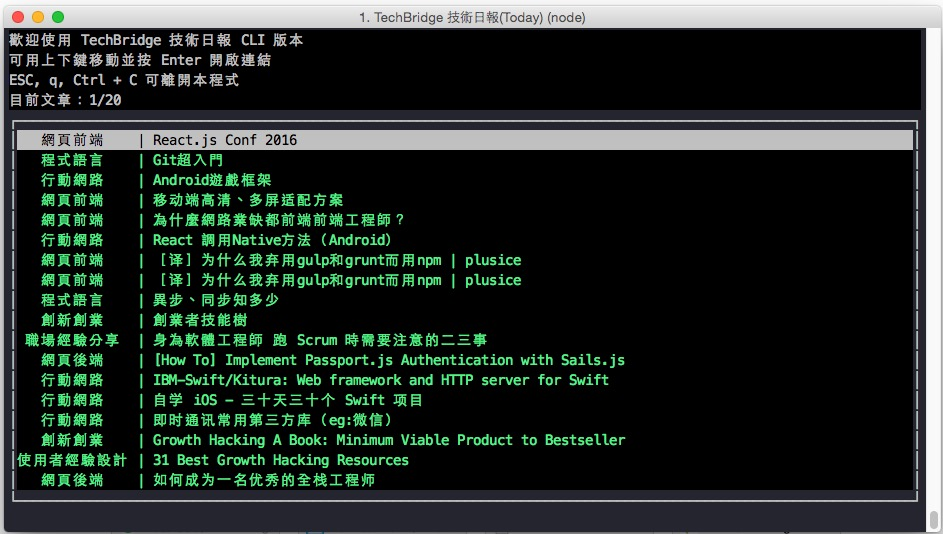

No# TechBridge-cli
> 用 CLI 瀏覽 [TechBridge](https://www.techbridge.cc/) 文章（受到 [hn-cli](https://github.com/rafaelrinaldi/hn-cli) 啟發）

# Install
`npm install -g `

# Usage
在 Terminal 輸入 `tb` 即可  
可用方向鍵上下瀏覽，按下 Enter 開啟文章  
按下 `q`, `ESC`, `Ctrl+C` 任一關閉程式

# License
MIT